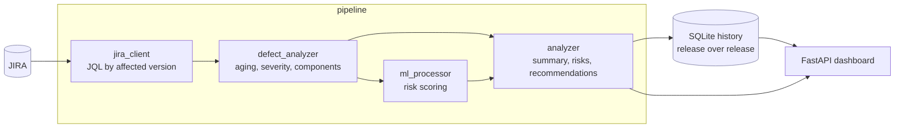

# jira-defect-intelligence


Pulls defects out of JIRA and looks for the patterns a burndown chart hides:
which defects were reopened after being closed, how well defects are written up,
how each project's health compares, and how volume moves release over release.

Serves it as a FastAPI dashboard.

## Why

Every team has JIRA metrics and most of them are counts. Open bugs, closed bugs,
bugs per sprint. Counts tell you the volume of work, not where quality is
actually leaking.

The questions worth answering are comparative: is this component always the one?
Are we reopening more than we used to? Those need the defect history in one
place and something to slice it with.

Be clear about one thing this cannot answer, because it is the question most
people want: **escape rate is not computed.** Telling a production escape from a
defect caught in QA needs a field that says where it was found, and no such
field exists in a default Jira. Adding it means deciding what your site records
and mapping it — worth doing, not done here, and an earlier version of this
README claimed it was.

## How it works



Issue types, custom-field ids and the severity field are all configuration:
every JIRA site assigns its own, so nothing about one site's scheme is baked in.

## What it does

**Collection** — `jira_client.py` and `defect_analyzer.py` fetch issues across
releases using `affectedVersion`, so analysis crosses project boundaries rather
than being trapped per JIRA project.

**Storage** — `database.py` persists to SQLite, so repeat analysis does not
re-hammer the JIRA API and history survives a release closing.

**Classification** — `ml_processor.py` trains scikit-learn models over derived
fields (priority, age, issue type, text lengths, reporter) to score three
things: whether a defect is high priority, whether it needs attention, and
whether it is of a critical type. It does not classify severity from the text
and there is no grouping model; the README said otherwise.

`openai_analyzer.py` optionally adds LLM analysis of defect text. It samples
records rather than being reserved for ambiguous ones, and it sends defect
summaries and descriptions to OpenAI — see [SECURITY.md](SECURITY.md) before
enabling it on real data.

The LLM path is optional and degrades cleanly: with no `OPENAI_API_KEY` the tool
runs the classical path and still works. That is deliberate — an analysis tool
that requires a paid API to start is one nobody trials.

**Reopens and write-up quality** — `count_reopens` reads the Jira changelog for
transitions out of a finished status, which is the signal worth having: an issue
closed once and an issue closed four times are identical in every count-based
metric and are not the same defect. `reporting_quality` scores whether a defect
has a description, a component, an assignee and a specific summary, and names
what is missing.

The changelog was already being fetched on every query and thrown away.

**Dashboard** — `dashboard.py` (FastAPI) renders the breakdowns: defects by
project and severity, aging, project health, and release-over-release volume.

## Setup

Python 3.11 or 3.12. Not 3.13: `jira==3.5.1` imports `imghdr`, which was
removed from the standard library in 3.13, so the import fails before anything
runs.

```bash
python3.11 -m venv venv && source venv/bin/activate
pip install -r requirements.txt
cp .env.example .env      # JIRA server, username, API token
python main.py            # API
python dashboard.py       # dashboard
```

The JIRA credential is an Atlassian API token, not your password. Generate one
at id.atlassian.com and give it read access; nothing here writes to JIRA.

## Running it without a JIRA

Unit tests exercise the analysis functions. They cannot tell you whether the
tool works, because the interesting part sits between the API and the
DataFrame: pagination, changelog parsing, field extraction, the JQL that gets
built. Handing the analyser a ready-made frame skips exactly the part most
likely to be wrong.

So there is a mock JIRA and a demo that drives the real client against it:

```bash
python scripts/mock_jira.py --port 8089 &
python scripts/demo.py
```

`mock_jira.py` serves generated issues over the JIRA REST API — paginated, with
changelogs containing real reopen transitions. The seed is fixed, so the numbers
below reproduce exactly. Output from an actual run:

```
--- reopens: the signal a count cannot show -----------------------
  45 of 240 defects came back after being closed (18.8%)
    reopened 3x: 1 defects
    reopened 2x: 9 defects
    reopened 1x: 35 defects
  most reopened:
    MOBILE-22    3 reopens, now Closed
    BILLING-74   2 reopens, now Resolved

--- write-up quality ----------------------------------------------
  65 of 240 defects score below 50% (27.1%)
    has_description              missing on 65
    has_components               missing on 65
    has_assignee                 missing on 65
    summary_is_specific          missing on 65

--- summary metrics -----------------------------------------------
  total_defects                240
  open_defects                 62
  resolved_defects             178
  resolution_rate              74.2
  avg_age_days                 170.8
  avg_age_open                 175.1
  unassigned_rate              27.1
  avg_resolution_time_hours    338.0

--- project health ------------------------------------------------
  SEARCH     health 0.424  open  16/58   avg age of open 164d
  BILLING    health 0.452  open  18/64   avg age of open 177d
  ORDERS     health 0.464  open  13/55   avg age of open 182d
  MOBILE     health 0.471  open  15/63   avg age of open 179d

15 of 15 checks passed
```

**Every figure above is generated.** It comes from a seeded fixture describing
four fictional projects, not from any real JIRA and not from any real team.

The fifteen checks are the point rather than the output. They test the metrics
against facts known about the generated data — that open and resolved account
for every defect, that the resolution rate matches the counts beneath it, that
an empty result set reports `None` rather than `0` or `NaN`. One of them exists
because of a specific bug:

```
PASS  Closed and Done count as resolved, not just the literal 'Resolved'
```

`analyzer.py` compared status against the single string `Resolved` in seven
places while `defect_analyzer.py` treated `Resolved`, `Closed`, `Done` and
`Fixed` as finished. On this fixture the difference is **74.2% resolved versus
31.7%** — the same defects, the same release, two answers, depending on which
report you happened to open.

## Reading the output honestly

Two traps worth naming, because this kind of dashboard invites both.

**Defect counts measure attention, not quality.** A component with many bugs may
be the most tested, not the worst written. The component with none may simply be
the one nobody looks at. Rank by reopen rate before you rank by raw count: a
defect that came back is evidence about the fix, and a count is not.

(Escapes to production would be the better ranking still. See above for why it
is not computed here.)

**The classifier learns your labelling habits, not ground truth.** It predicts
what your team *would have labelled*, including the inconsistencies. If severity
is assigned inconsistently — and it usually is — the model reproduces that
faithfully. Useful for triage suggestions, not for a quality KPI.

Do not put reporter-quality metrics in front of management without that caveat
attached. Ranking people by defect counts changes how people file defects, and
not for the better.

## Scope

Extracted from a larger working directory. Several exploratory analyzer variants
and debug scripts were left behind; what is here is the set that the dashboard
and API actually import.

## Contributing

Bug reports and pull requests are welcome. [CONTRIBUTING.md](CONTRIBUTING.md)
covers the setup and the gate that must be green before a PR. Everyone taking
part is expected to follow the [Code of Conduct](CODE_OF_CONDUCT.md).

For a security problem, do not open an issue: see [SECURITY.md](SECURITY.md).

## License

MIT. See [LICENSE](LICENSE).
